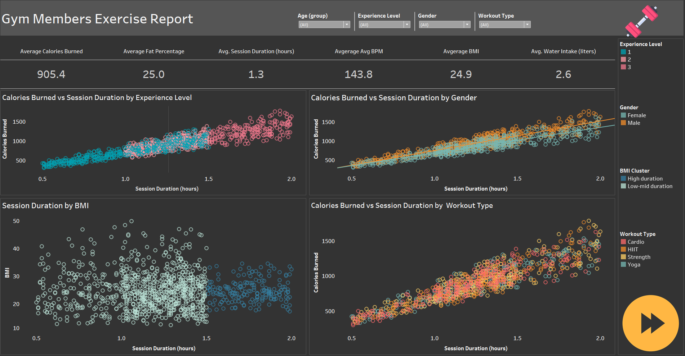
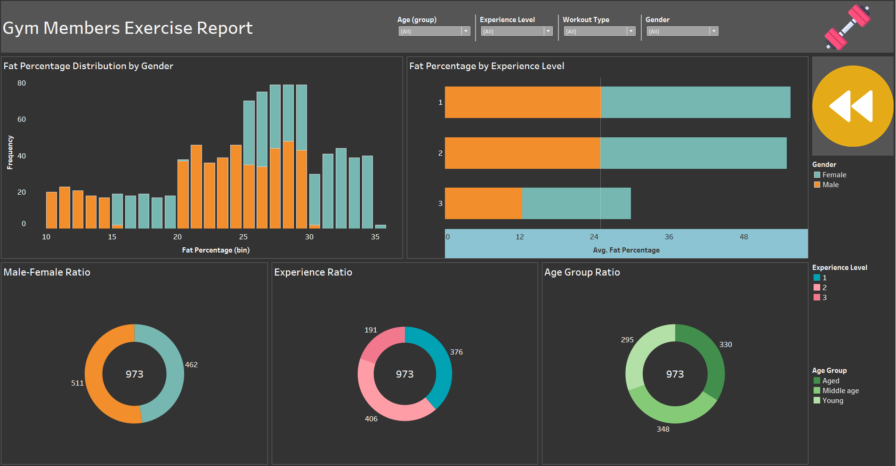

# Gym Member Analysis Dashboard

## Overview
This Tableau dashboard provides insights into gym member data across various health metrics, including calories burned, session duration, BMI, and water intake. Filters are applied for age group, experience level, gender, and workout type to allow a customized exploration of data trends.

## Dashboard Previews

Dashboard 1

Dashboard 2

## Key analysis:
i.	Calories Burned vs. Session Duration: Segmented by experience level, gender, workout type, and age group (Young, Mid-age, Old).
ii.	Session Duration by BMI: Shows session length in relation to BMI.
iii.	Fat Percentage Distribution: Overview of fat percentage across demographics.
iv.	Average Fat Percentage by Experience: Breaks down average fat percentages by experience level.
v.	Male-Female Ratio: Displays the proportion of male to female members.
vi.	Experience Level Ratio: Shows distribution across beginner (1), intermediate (2), and advanced levels (3).
vii.	Age Group Ratio: Indicates membership by age groups.
viii.	Key Metrics:
o	Average calories burned, fat percentage, session duration, BPM, BMI, and water intake.

## Key Insights
- **BMI**: Female members have a lower average BMI than male members.
- **Water Intake**: Experienced members and male members show higher water intake levels.
- **Fat Percentage**: Experienced members generally have a lower fat percentage, while female members tend to have a higher average fat percentage.
- **Session Duration**: Session length has a more substantial impact on calories burned than workout type.
- **Calories Burned**: Male members tend to burn more calories per session.
- **Experience and Session Duration**: Experienced members typically engage in longer session durations.

## Filters
- **Age Group**: Enables selection of specific age groups.
- **Experience Level**: Filters data based on member experience levels.
- **Gender**: Allows filtering based on gender.
- **Workout Type**: Refines data according to workout type.

## Note: Everything is cross-validated with SQL querying
